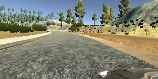
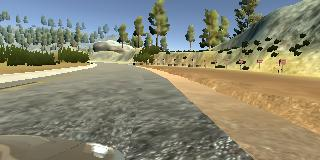
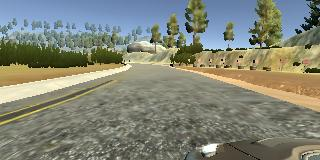
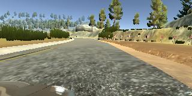

**Behavioral Cloning Project**

The goals / steps of this project are the following:
* Use the simulator to collect data of good driving behavior
* Build, a convolution neural network in Keras that predicts steering angles from images
* Train and validate the model with a training and validation set
* Test that the model successfully drives around track one without leaving the road
* Summarize the results with a written report


#### Submission includes all required files and can be used to run the simulator in autonomous mode

My project includes the following files:
* model.py containing the script to create and train the model
* drive.py for driving the car in autonomous mode
* model.h5 containing a trained convolution neural network
* run1.mp4 video of results
* writeup_report.md summarizing the results

####  Submission includes functional code
Using the Udacity provided simulator and my drive.py file, the car can be driven autonomously around the track by executing

```sh
python drive.py models/track1/model.h5
```

####  Submission code is usable and readable

The model.py file contains the code for training and saving the convolution neural network. The file shows the pipeline I used for training and validating the model, and it contains comments to explain how the code works.

### Model Architecture and Training Strategy

#### An appropriate model architecture has been employed

I used the following model architecture:


* conv2d_2 (Conv2D)            (None, 20, 77, 36)        21636
* conv2d_3 (Conv2D)            (None, 16, 73, 48)        43248
* conv2d_4 (Conv2D)            (None, 14, 71, 64)        27712
* conv2d_5 (Conv2D)            (None, 12, 69, 64)        36928
* dropout_1 (Dropout)          (None, 12, 69, 64)        0
* flatten_1 (Flatten)          (None, 52992)             0
* dense_1 (Dense)              (None, 100)               5299300
* dense_2 (Dense)              (None, 50)                5050
* dense_3 (Dense)              (None, 10)                510
* dense_4 (Dense)              (None, 1)                 11

The model is implemented in model.py file in the buildModel method.
As seen in the implementation relu layers to introduce nonlinearity after all convolutional layers.


#### Attempts to reduce overfitting in the model

My model contains a single dropout layer, having a value of 0.5. This layer was introduced when I noticed that the train model was performing better on the training data than on the validation data. This is often an indication that the model is overfitting. Thus I added a dropout layer to reduce this overfitting.


#### Augmenting the data:
I did not used the provided Udacity data set. Instead I used the simulator to collect my data. My approach to collecting this data was perform a lot of sharp left and right turns. I believe doing emphasized the importance of not running off the road.

I first tried to train the model with a lot of augmented data. All of these attempts were unsuccessful. Eventually in dispair I tried the training the model with a small amount of data, collected as described above. I also only use the center image(because who really drives with 3 cameras).

It worked. You can see the video of the result here : [video](https://github.com/LeotisBuchanan/udacity_behavior_cloning/blob/track-one-model-generation-feature/run1.mp4?raw=true)

####3. Model parameter tuning

My approach to parameter tuning was as follows:

Initially I implemented the nvidia architecture. I then trained a few models using data I had collected from each track. They all failed to complete the track. First I tried improving my augmentation pipeline. But this only increase my training time to days. When the car failed to complete the track I change from ELU to RELU, I also increased the amount of conv2d layers. Not of this worked. I collected more data, played with the filter sizes, add max pooling etc.

After a few weeks trying to get this to work, I decided to try a simple network and no data augmentation. I also decided to try data from track1 first. I also decided to only use the center camera. After doing this and retraining the model. It work!!. At this point I still do not understand why.

I used the standard adam optimiser with mse for loss metrics. As a result I did not have to tune the learning rate manually.

#### Appropriate training data

I spent hours gathering training data, recovering from left, recovering from right etc. Augmenting the data etc. Then I decided to just try using only the center camera. I also decided to drive in such away that my training data contain a lot of recovering from left and right.


#### examples of images that my model was trained on:







### Model Architecture and Training Strategy

#### Solution Design Approach

The overall strategy for deriving a model architecture was to review all the model architectures that have been used by my peers to successfully solve this problem. I then experimented with them to see which performed better. For me they all performed poorly. I guess something was wrong with my approach or with my data.

I then settled on a cnn similar to the nvidia architecture. I thought this model would be appropriate because it as been used successfully by many others.

First I tried using all 3 images, this did not work very well for me. So I only used the center image.

#### Final Model Architecture

The final model architecture (model.py lines 21-37) consisted of a convolution neural network with the following layers and layer sizes:

* conv2d_2 (Conv2D)            (None, 20, 77, 36)        21636
* conv2d_3 (Conv2D)            (None, 16, 73, 48)        43248
* conv2d_4 (Conv2D)            (None, 14, 71, 64)        27712
* conv2d_5 (Conv2D)            (None, 12, 69, 64)        36928
* dropout_1 (Dropout)          (None, 12, 69, 64)        0
* flatten_1 (Flatten)          (None, 52992)             0
* dense_1 (Dense)              (None, 100)               5299300
* dense_2 (Dense)              (None, 50)                5050
* dense_3 (Dense)              (None, 10)                510
* dense_4 (Dense)              (None, 1)                 11


#### Creation of the Training Set & Training Process

In collecting the data, Instead of trying to to capture good driving behavior, I drove the emphasize staying on the road and avoiding running of the road. I recorded 3 laps, using this approach.

Originally I augmented the data, so that I add 84,000 points. My model took almost a  week to train on my mac book pro. Unfortunate the resulting model did not complete the track.

I then decided not to reduce my training set and not augment the images. This approach worked.

After the collection process, I had 22914 data points. I then preprocessed this data by cropping the top and bottom of the image to remove the irrelevant parts of the image.

I used 20% of the data for validation and 80% for testing. The data was shuffled after each epoch.

I used this training data for training the model. The validation set helped determine if the model was over or under fitting. I tried 5 epochs initially, but the model validation and training accuracy was only 52%.After I increase the epochs to 10. I achieved an accuracy of 62%.
